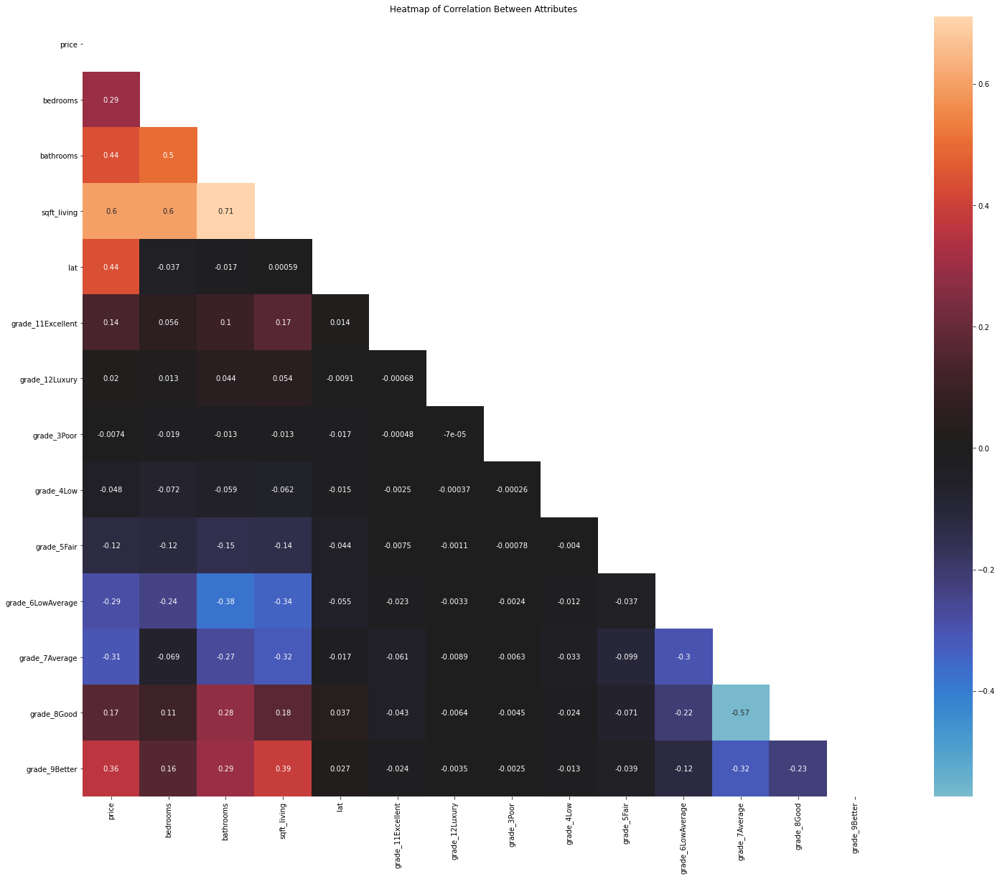
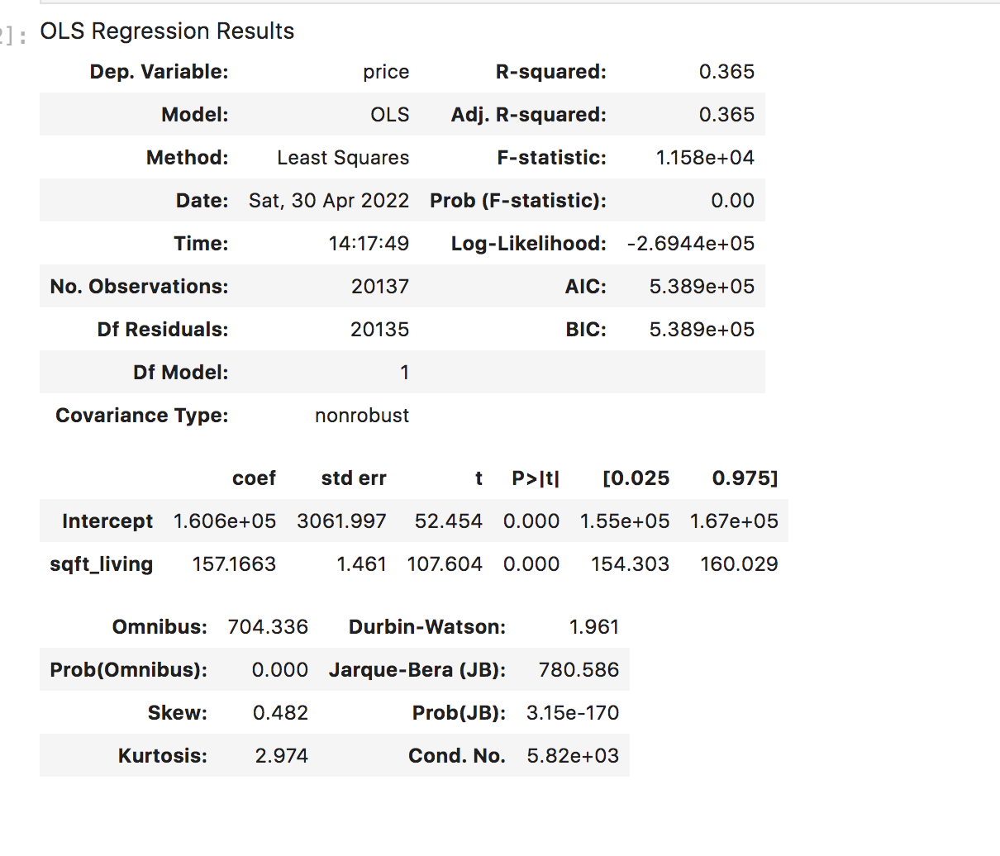
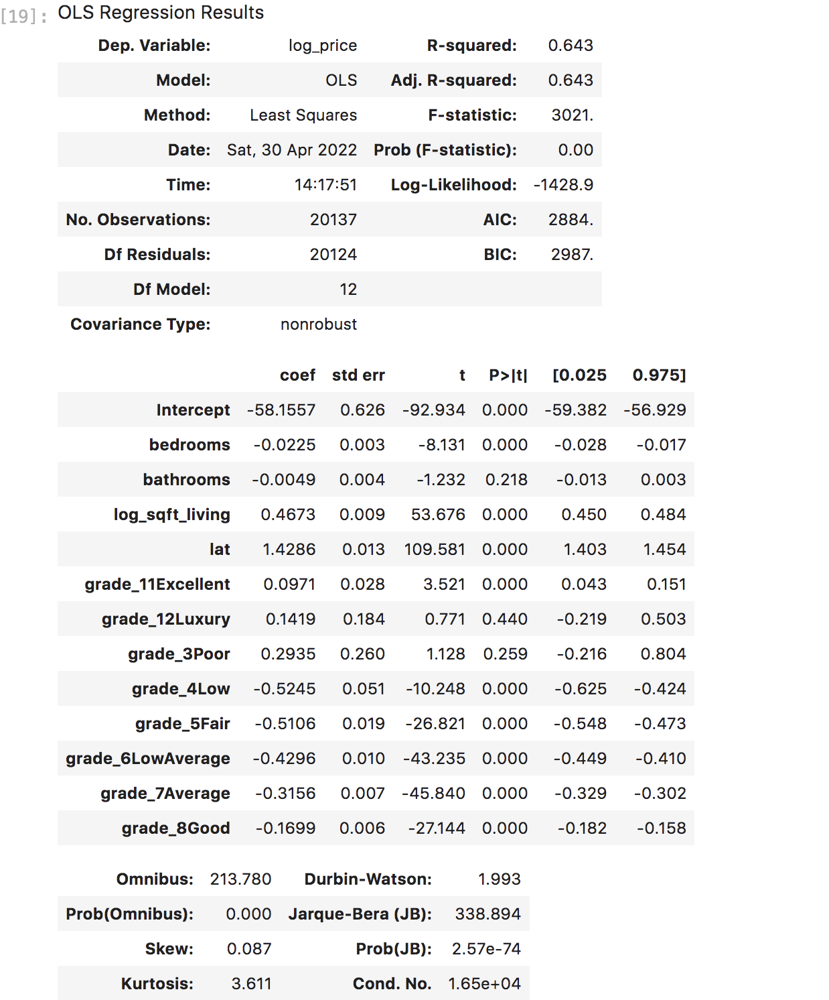
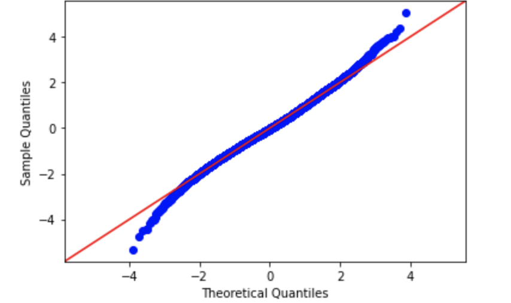
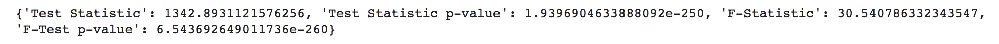
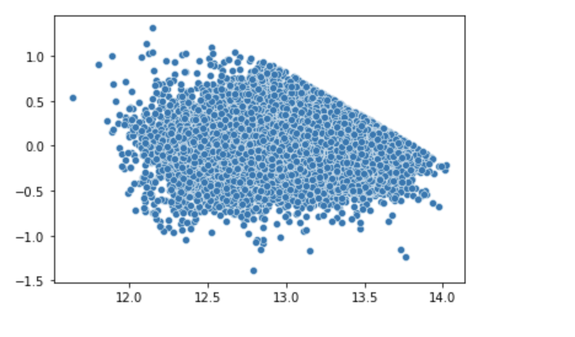

# Northwestern County 1st Time Home Buyer Analysis

**Authors**: Armun Shakeri

## Overview

This project analyzes homes available in today's housing market and examines which of those homes would be appropriate for a first time home buyer. Also how price of a home is affected by independent values like sqft_living and price.

## Business Problem

Recently property values have been increasing throughout the United States. For those wanting to buy their first home, there are many factors that might raise the price of that home. This project analyzes these factors and explores whether they have a positive or negative affect on price.

## Data

For this project we gathered information regading homes, including price, bedroom and bathroom count, sqft_living, sqft_basement, lat location, and grade. This information was gathered from kc_house_data (king county housing data). The key items we were looking for in this data was information that would be best suited for a first time home buyer.

## Methods

After aquiring the data we needed to drop all features that would be irrelevant for the majority of home buyers. We dropped id, date, sqft_living15, sqft_lot15, yr_built, long, floors, condition, sqft_above, sqft_lot, waterfront, yr_renovated, view, and zipcode. From there we dropped all n/a values then set the price to <= $1,000,000, and set the amount of bedrooms to <= 10. Finally we created the dummy variables for our only categorical variable, grade. 

## Results

The first step in analysis was identifying which variable would be our dependent variable, price, and what independant variables were the highest correlated to it. We identified that sqft_living and bathrooms were the two most correlated independant values. From there we created our baseline model, with only sqft_living included this model had an R-squared of 0.365 which was too low to begin analysis. We added bedrooms, bathrooms, lat, and various grades of homes represented. We ended up with an R-squared of 0.615 which was high enough to begin analysis. The first feature we analyzed was sqft_living, from the regression model sqft_living was heteroscedastic, this needed to be fixed through a log transformation. Price was also not evenly distributed, so it was log transformed as well. The final model showed an r_squared of 0.643 and the qq-plot for that model also showed that it was mostly evenly distributed. The final steps of analysis was to perform white's test and a scatter plot for distributions. White's test had a Test Statistic p-value': 1.9396904633888092e-250 and the scatter plot showed that this analysis met assumptions. 

### Visual 1

We see below that the highest to lowest correlated are as follows:
1) price x sqft_living
2) price x bathrooms

### Visual 2

Model displays low R-squared value, will need to add more values to raise R-squared

### Visual 3

After adding lat, bathrooms, and various grades R-squared now has a value of .615

### Visual 4

Q-Q plot shows normality of distribution

### Visual 5

White's test and the plot of residuals both support the claim that assumptions were met. 

## Conclusions

The following below are reccomendations for a first time home buyer: 
    
    1) For every 1% increase in sqft_living price will experience a .46% increase. 
    
    2) Homes with grades of 4, 5, 6, 7, and 8 have a negative affect on price while 
       homes with grades of 3 12 and 11 have a positive affect on price. 

    3) Bathrooms do not have an affect on the homes price. 

This analysis still might not fully answer every question a first time home buyer will have since it leaves
out outliers and location features of homes. In the future we could include more location features such as 
zipcode, latitude and longitude to help first time home buyers explore different homes within kc county 
that might have been left out. 

## For More Information

Please review our full analysis in analysis.ipynb or our [presentation](./DS_Project_Presentation.pdf).

For any additional questions, please contact Armun Shakeri ashakeri62@gmail.com 

## Repository Structure

├── data
├── images
├── analysis.ipynb
├── CONTRIBUTING.md
├── LICENSE.md
├── Presentation.pdf
├── README.md 